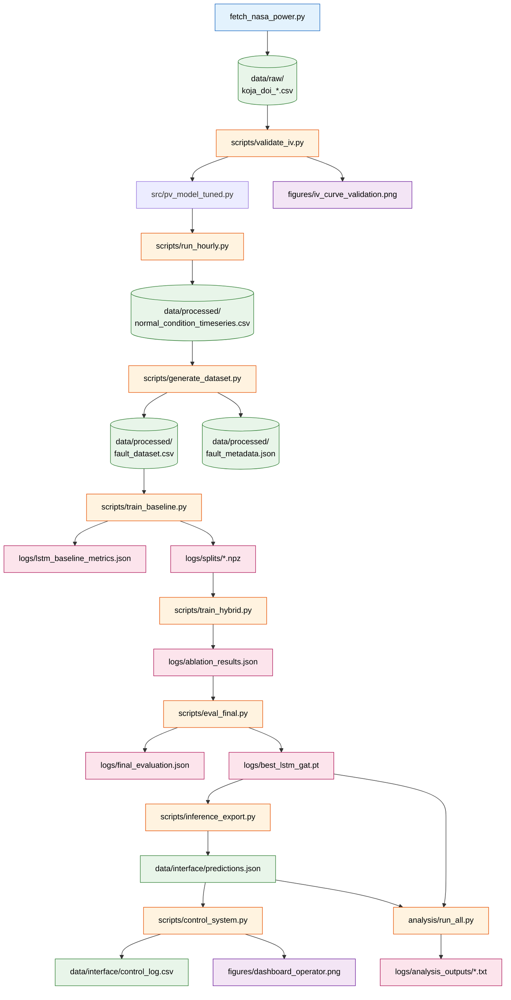

# Sistem Kontrol PLTS untuk Deteksi Dini dan Lokalisasi *Fault*

**Studi Kasus:** PLTS Pulau Koja Doi, Kabupaten Sikka, Nusa Tenggara Timur\
**Relevansi:** Program 100 GW Pemerintah Indonesia (2026–2029)\
**Penulis:** Fransiskus Serfian Jogo\
**Tanggal:** 24 September 2026


---

## Ringkasan

Repositori ini berisi *pipeline* lengkap untuk desain sistem kontrol PLTS berbasis kecerdasan buatan yang mampu mendeteksi *fault* secara dini dan mengidentifikasi lokasinya, meskipun dengan keterbatasan data historis. Studi kasus difokuskan pada PLTS Koja Doi (190 kWp) dengan konfigurasi *proof-of-concept* 3 *string* × 4 panel.

Pendekatan yang digunakan:

1. **Data sintetik berbasis fisika** — model *single-diode* dengan *auto-tuning* parameter
2. **Arsitektur *hybrid* AI** — LSTM untuk temporal, *Graph Attention Network* untuk spasial, dan *Physics-Informed Neural Network* untuk konsistensi fisika
3. **Lapisan aksi kontrol** — *state machine* untuk isolasi *fault* otomatis
4. **Rekomendasi kebijakan** — untuk mendukung program 100 GW PLTS

**Hasil utama:**

- F1-*score* deteksi: **0,7762** (*precision* 0,9975, *recall* 0,6353)
- *Latency* deteksi median: **6 *time step*** (LLF: 0 *step*, PSC: 6 *step*, LGF: 24 *step*)
- *Detection rate*: **100%** (24 dari 24 skenario *fault*)
- Waktu isolasi otomatis: **6 *time step*** setelah *onset fault*

---

## Struktur Repositori

```
kojadoi-fault-detection/
├── README.md
├── requirements.txt
├── fetch_nasa_power.py
├── src/
│   ├── __init__.py
│   ├── pv_model.py
│   ├── pv_model_tuned.py            (di-generate oleh validate_iv.py)
│   ├── fault_injection.py
│   ├── preprocessing.py
│   ├── dataset.py
│   ├── model_lstm.py
│   └── model_hybrid.py
├── scripts/
│   ├── validate_iv.py
│   ├── run_hourly.py
│   ├── generate_dataset.py
│   ├── train_baseline.py
│   ├── train_hybrid.py
│   ├── eval_final.py
│   ├── qualitative_analysis.py
│   ├── inference_export.py
│   └── control_system.py
├── analysis/
│   ├── 01_weather_statistics.py
│   ├── 02_iv_validation_stats.py
│   ├── 03_dataset_statistics.py
│   ├── 04_metadata_verification.py
│   ├── 05_physics_consistency.py
│   ├── 06_split_verification.py
│   ├── 07_baseline_metrics.py
│   ├── 08_pinn_status.py
│   ├── 09_baseline_vs_hybrid.py
│   ├── 10_latency_analysis.py
│   ├── 11_latency_vs_severity.py
│   ├── 12_threshold_safety.py
│   ├── 13_per_class_analysis.py
│   ├── 14_control_log_verification.py
│   ├── 15_environment_verification.py
│   └── run_all.py
├── data/
│   ├── raw/
│   ├── processed/
│   └── interface/
├── figures/
├── logs/

```

---

## Instalasi

**Prasyarat:** Python 3.10+ (direkomendasikan 3.11)

```bash
# Clone repository
git clone https://github.com/fian-jogo/kojadoi-fault-detection.git
cd kojadoi-fault-detection

# Buat virtual environment
python -m venv venv
venv\Scripts\activate          # Windows
# atau
source venv/bin/activate       # Linux/Mac

# Install dependensi
pip install -r requirements.txt
```

**`requirements.txt`:**

```
pvlib>=0.15.2
pandas>=3.0.5
numpy>=2.5.3
matplotlib>=3.8.0
scipy>=1.11.0
torch>=2.14.0
requests>=2.31.0
```

---

## Urutan Menjalankan *Pipeline*

Jalankan skrip dalam urutan berikut. Setiap langkah menghasilkan *output* yang menjadi input untuk langkah berikutnya.

### Ringkasan Cepat

| #  | Script                        | Output Utama                                                                    |
|----|-------------------------------|---------------------------------------------------------------------------------|
| 1  | `fetch_nasa_power.py`         | `data/raw/koja_doi_irradiance_temperature_hourly.csv`                           |
| 2  | `scripts/validate_iv.py`      | `src/pv_model_tuned.py`, `figures/iv_curve_validation.png`                      |
| 3  | `scripts/run_hourly.py`       | `data/processed/normal_condition_timeseries.csv`                                |
| 4  | `scripts/generate_dataset.py` | `data/processed/fault_dataset.csv`, `data/processed/fault_metadata.json`        |
| 5  | `scripts/train_baseline.py`   | `logs/lstm_baseline_metrics.json`, `logs/splits/*.npz`                          |
| 6  | `scripts/train_hybrid.py`     | `logs/ablation_results.json`                                                    |
| 7  | `scripts/eval_final.py`       | `logs/final_evaluation.json`, `logs/best_lstm_gat.pt`                           |
| 8  | `scripts/qualitative_analysis.py` | `figures/qualitative_examples.png`                                          |
| 9  | `scripts/inference_export.py` | `data/interface/predictions.json`                                               |
| 10 | `scripts/control_system.py`   | `data/interface/control_log.csv`, `figures/dashboard_operator.png`              |
| 11 | `analysis/run_all.py`         | `logs/analysis_outputs/*.txt`                                                   |


---

### Langkah 1: Akuisisi Data

**Jalankan:**

```bash
python fetch_nasa_power.py
```

**Akan muncul:**

```
Mengunduh data dari NASA POWER ...
Data tersimpan di: ...\data\raw\koja_doi_irradiance_temperature_hourly.csv
Total baris: 4344
Missing values: 0
```

**Setelah itu:** lanjutkan ke **Langkah 2**.

---

### Langkah 2: Validasi Model PV + Auto-Tuning

**Jalankan:**

```bash
python scripts\validate_iv.py
```

**Akan muncul:**

```
=== Sebelum tuning ===
  R_s = 0.3500 Ohm | R_sh = 300.00 Ohm | I_o_ref = 1.000e-10 A
  Voc  error: +13.85%
  Isc  error: +0.08%
  Pmax error: +10.76%

[Tuning Tahap 1] Nelder-Mead ...
[Tuning Tahap 2] L-BFGS-B ...

=== Sesudah tuning ===
  R_s = 0.1065 Ohm | R_sh = 528536054.76 Ohm | I_o_ref = 2.502e-09 A
  Voc  error: -0.54%  OK
  Isc  error: +0.20%  OK
  Pmax error: +0.90%  OK

Plot disimpan: figures/iv_curve_validation.png
Parameter hasil tuning disimpan ke: src/pv_model_tuned.py
```

**Akan dihasilkan:**

- `src/pv_model_tuned.py` — parameter modul hasil *tuning* (R_s, R_sh, I_o)
- `figures/iv_curve_validation.png` — kurva I-V dan P-V sebelum/sesudah *tuning*
- `logs/tuning_report.json` — ringkasan *tuning*

**Setelah itu:** lanjutkan ke **Langkah 3**.

---

### Langkah 3: Time Series Kondisi Normal

**Jalankan:**

```bash
python scripts\run_hourly.py
```

**Akan muncul:**

```
[info] Memakai parameter hasil tuning.
Input: 4344 baris
Tersimpan: ...\data\processed\normal_condition_timeseries.csv
Total energi (kWh): 4235.2
Puncak daya (W): 4868.5
Capacity factor: 20.31%
Plot: figures/timeseries_7days.png
```

**Akan dihasilkan:**

- `data/processed/normal_condition_timeseries.csv` — *time series* V, I, P kondisi normal
- `figures/timeseries_7days.png` — plot daya 7 hari pertama

**Setelah itu:** lanjutkan ke **Langkah 4**.

---

### Langkah 4: Generasi Dataset Fault Sintetik

**Jalankan:**

```bash
python scripts\generate_dataset.py
```

**Akan muncul:**

```
Data cuaca: 1972 baris siang
Dataset: ...\data\processed\fault_dataset.csv (216000 baris)
Fault aktif: 47892 (22.17%)
Plot: figures/fault_examples.png
Selesai.
```

**Akan dihasilkan:**

- `data/processed/fault_dataset.csv` — 216.000 baris, 180 skenario (30 normal + 50 LLF + 50 LGF + 50 PSC)
- `data/processed/fault_metadata.json` — metadata 180 skenario
- `figures/fault_examples.png` — contoh tiga jenis *fault*

**Setelah itu:** lanjutkan ke **Langkah 5**.

---

### Langkah 5: Training Baseline LSTM

**Jalankan:**

```bash
python scripts\train_baseline.py
```

**Akan muncul:**

```
Device: cpu
Epoch   1/30 | train=0.9867 | val=0.7441 | acc=0.7189 | F1=0.0000
Epoch   5/30 | train=0.6545 | val=0.6016 | acc=0.8186 | F1=0.5387
Epoch  10/30 | ...
Epoch  20/30 | ...
Epoch  30/30 | train=0.4151 | val=0.4274 | acc=0.8885 | F1=0.7665

Test F1: 0.7532 | Acc: 0.8791 | Prec: 0.9694 | Rec: 0.6159
Top-1: 0.3096 | Top-3: 0.5851 | IoU: 0.1530
[done] Baseline LSTM selesai.
```

**Akan dihasilkan:**

- `data/processed/train_val_test_split.npz` — split data untuk training selanjutnya
- `logs/lstm_baseline_metrics.json` — metrik baseline
- `figures/training_curves.png` — kurva *training* baseline
- `figures/confusion_matrix_lstm.png` — *confusion matrix* baseline

**Setelah itu:** lanjutkan ke **Langkah 6**.

---

### Langkah 6: Training Model Hybrid + Ablation Study

**Jalankan:**

```bash
python scripts\train_hybrid.py
```

**Akan muncul (untuk setiap dari 7 konfigurasi):**

```
============================================================
  Konfigurasi: LSTM+GAT
  use_gat=True, use_pinn=False, frac=1.0
============================================================
  Train window: 8946
  Parameter: 64,227
  Epoch   1/30 | train=0.7737 | F1=0.5149 | acc=0.8068
  Epoch   5/30 | ...
  Epoch  30/30 | train=0.3913 | F1=0.8033 | acc=0.9070
  Test F1: 0.7762 | Acc: 0.8902 | Rec: 0.6353
```

**Diakhiri dengan ringkasan:**

```
Config                         F1     Acc     Rec   Top1Loc     IoU
----------------------------------------------------------------------
LSTM_baseline              0.7532  0.8791  0.6159    0.3096  0.1530
LSTM+GAT                   0.7762  0.8902  0.6353    0.3825  0.1699
LSTM+GAT+PINN              0.7720  0.8878  0.6337    0.3420  0.1763
...
[done] Ablation selesai.
```

**Akan dihasilkan:**

- `logs/ablation_results.json` — hasil 7 konfigurasi
- `figures/ablation_study.png` — plot perbandingan
- `figures/training_curves_hybrid.png` — kurva *training hybrid*

**Setelah itu:** lanjutkan ke **Langkah 7**.

---

### Langkah 7: Evaluasi Final

**Jalankan:**

```bash
python scripts\eval_final.py
```

**Akan muncul:**

```
Device: cpu
[1/6] Load split ...
[2/6] Load metadata fault ...
[3/6] Load checkpoint ... (atau Train LSTM+GAT)
[4/6] Inference pada test set ...
F1: 0.7762 | Acc: 0.8902 | Prec: 0.9975 | Rec: 0.6353
Latency median: 6.0 | mean: 10.3
Per-class:
  LLF     F1=1.0000  Rec=1.0000
  LGF     F1=0.0741  Rec=0.0385
  PSC     F1=0.9347  Rec=0.8775
Threshold sweep: best F1 di 0.50, high recall di 0.20
[done] Evaluasi final selesai.
```

**Akan dihasilkan:**

- `logs/final_evaluation.json` — metrik lengkap
- `logs/latency_per_scenario.csv` — *latency* per skenario
- `logs/best_lstm_gat.pt` — *checkpoint* model terbaik (untuk *deployment*)
- `figures/confusion_matrix_final.png`
- `figures/latency_histogram.png`
- `figures/per_class_metrics.png`
- `figures/threshold_sweep.png`

**Setelah itu:** lanjutkan ke **Langkah 8**.

---

### Langkah 8: Analisis Kualitatif

**Jalankan:**

```bash
python scripts\qualitative_analysis.py
```

**Akan muncul:**

```
[1/3] Load model dan data ...
[2/3] Cari contoh kasus ...
       success_LLF: scenario 33 (LLF)
       failure_FN: scenario 81 (LGF)
[3/3] Plot ...
       Tersimpan: figures/qualitative_examples.png
```

**Akan dihasilkan:**

- `figures/qualitative_examples.png` — contoh kasus sukses dan gagal

**Setelah itu:** lanjutkan ke **Langkah 9**.

---

### Langkah 9: Ekspor Prediksi ke JSON

**Jalankan:**

```bash
python scripts\inference_export.py
```

**Akan muncul:**

```
Device: cpu
[1/4] Load split ...
[2/4] Load checkpoint (cepat) ...
       Loaded: ...\logs\best_lstm_gat.pt
       best_val_f1: 0.8053
[3/4] Inference pada test set ...
       Skenario dipilih: 156 (40 fault aktif)
[4/4] Simpan ke JSON ...
       Tersimpan: ...\data\interface\predictions.json
[done] Inference export selesai.
```

**Akan dihasilkan:**

- `data/interface/predictions.json` — prediksi per *time step* untuk skenario terpilih

**Setelah itu:** lanjutkan ke **Langkah 10**.

---

### Langkah 10: Sistem Kontrol Otomatis

**Jalankan:**

```bash
python scripts\control_system.py
```

**Akan muncul:**

```
===========================================================
  KONTROL SISTEM PLTS KOJA DOI - PYTHON ACTION LAYER
===========================================================

[1/4] Membaca predictions.json ...
       Skenario ID : 156
       Jumlah step : 71
       Jumlah node : 12
[2/4] Menjalankan state machine ...
[3/4] Menyimpan log ...
       Tersimpan: ...\data\interface\control_log.csv
[4/4] Membuat dashboard ...
       Tersimpan: ...\figures\dashboard_operator.png

=== CONTROL STATE MACHINE SUMMARY ===
Total time step       : 71
Fault aktif (GT)      : 40
Waktu dalam NORMAL     :  30 (42.3%)
Waktu dalam DETECTING  :   4 (5.6%)
Waktu dalam ISOLATING  :   1 (1.4%)
Waktu dalam ISOLATED   :  36 (50.7%)
Total isolasi         : 1 kali
Isolasi pertama       : time step 36
```

**Akan dihasilkan:**

- `data/interface/control_log.csv` — log *state machine* per *time step*
- `figures/dashboard_operator.png` — *dashboard* empat panel

**Setelah itu:** lanjutkan ke **Langkah 11**.

---

### Langkah 11: Analisis dan Verifikasi

**Jalankan semua skrip analisis sekaligus:**

```bash
python analysis\run_all.py
```

**Atau jalankan satu per satu:**

```bash
python analysis\01_weather_statistics.py
python analysis\02_iv_validation_stats.py
python analysis\03_dataset_statistics.py
python analysis\04_metadata_verification.py
python analysis\05_physics_consistency.py
python analysis\06_split_verification.py
python analysis\07_baseline_metrics.py
python analysis\08_pinn_status.py
python analysis\09_baseline_vs_hybrid.py
python analysis\10_latency_analysis.py
python analysis\11_latency_vs_severity.py
python analysis\12_threshold_safety.py
python analysis\13_per_class_analysis.py
python analysis\14_control_log_verification.py
python analysis\15_environment_verification.py
```

**Akan muncul (contoh untuk `08_pinn_status.py`):**

```
============================================================
  08. KONFIRMASI STATUS PINN
============================================================
Total konfigurasi: 7

=== Konfirmasi Pasangan PINN vs non-PINN ===
  Fraksi 100%:
    F1  : 0.7762 -> 0.7720 (delta=-0.0042)
    IoU : 0.1699 -> 0.1763 (delta=+0.0064)
    Status: NETRAL (PINN setara)

  Fraksi 50%:
    F1  : 0.7167 -> 0.7243 (delta=+0.0076)
    Status: POSITIF (PINN membantu)

  Fraksi 20%:
    F1  : 0.6815 -> 0.6641 (delta=-0.0174)
    Status: NEGATIF (PINN merugikan)
```

**Akan dihasilkan:**

- `logs/analysis_outputs/*.txt` — output setiap skrip analisis

Skrip analisis ini memverifikasi bahwa **semua angka di LAPORAN AKHIR dapat direproduksi secara independen** dari *output* yang tersimpan.

---

## Ringkasan Alur Data

```
## Pipeline Eksekusi


```

---

## Reproducibility

Semua skrip menggunakan **seed 42** untuk memastikan hasil dapat direproduksi. Jika ada perbedaan angka saat dijalankan ulang, kemungkinan penyebabnya:

1. **Versi *library* berbeda** — `pvlib`, `numpy`, `torch` dapat menghasilkan angka yang sedikit berbeda di versi berbeda.
2. **Data NASA POWER berubah** — NASA POWER kadang mengoreksi data historisnya.
3. **Perbedaan *device*** — CPU vs GPU dapat menghasilkan hasil yang sedikit berbeda karena operasi *floating-point*.

Untuk verifikasi lengkap, jalankan `analysis/15_environment_verification.py` yang akan mencetak versi *library* dan *device* yang digunakan.

---
